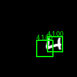
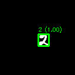
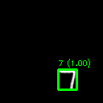
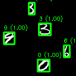
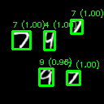
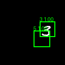
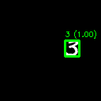
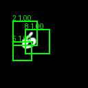

## Tarefa 1 — Classificação de Dígitos (MNIST)

### Objetivo
O objetivo desta tarefa foi desenvolver um modelo de classificação de imagens capaz de reconhecer corretamente dígitos manuscritos (0–9) a partir do dataset **MNIST** completo e avaliar o seu desempenho através de métricas detalhadas por classe e de uma matriz de confusão. Foi usado como base os ficheiros da aula 11.

---

### Metodologia

Para esta tarefa foi utilizada uma rede neuronal convolucional (CNN), adequada para problemas de visão computacional.  
A arquitetura é composta por duas partes principais:

- **Extração de características:** camadas convolucionais que aprendem padrões visuais como contornos e formas, com *Batch Normalization* para estabilizar o treino, *ReLU* como função de ativação, *Max Pooling* para redução espacial e *Dropout* para evitar overfitting.
- **Classificação:** após a extração de características, os dados são achatados (*flattened*) e processados por camadas totalmente ligadas, terminando numa camada de saída com 10 neurónios, um para cada dígito.

O modelo foi treinado com **Cross-Entropy Loss** e otimização com **Adam**, utilizando o conjunto completo de treino do MNIST. Esta abordagem permitiu obter bons resultados para todas as classes.

---

### Resultados

O desempenho do modelo foi avaliado no conjunto de teste do MNIST através das seguintes métricas:
- Accuracy
- Precision, Recall e F1-score por classe
- Média das métricas

A tabela seguinte apresenta os valores obtidos para cada dígito:

 |  

Para analisar os erros de classificação, foi também gerada a matriz de confusão:

De forma geral, o modelo apresenta elevada accuracy e métricas consistentes entre as diferentes classes, indicando uma boa capacidade de generalização. Os poucos erros observados concentram-se sobretudo em dígitos com formas visuais semelhantes, o que é esperado neste tipo de problema.

## Tarefa 2 — Geração de Datasets

### Objetivo
O objetivo desta tarefa foi gerar datasets sintéticos de cenas com dígitos manuscritos, a partir do MNIST, de forma a simular um problema de deteção de objetos. Foram criadas quatro versões de dataset (A, B, C e D), com diferentes níveis de complexidade, permitindo analisar como a variação no número de dígitos e na escala afeta os dados.

---

### Metodologia

O dataset é gerado criando imagens vazias onde são colocados aleatoriamente dígitos do MNIST, com controlo do número de dígitos e do seu tamanho conforme a versão (A–D), garantindo que não se sobrepõem através da verificação de interseção entre as áreas de cada dígito.

Foram definidas quatro variantes:

- **Dataset A:** uma imagem contém **apenas um dígito**, com tamanho fixo.
- **Dataset B:** uma imagem contém **apenas um dígito**, mas com **variação de escala**.
- **Dataset C:** uma imagem contém **múltiplos dígitos**, com tamanho fixo.
- **Dataset D:** uma imagem contém **múltiplos dígitos** e **variação de escala**.

Para cada versão foram gerados conjuntos de treino e teste, sendo posteriormente calculadas estatísticas do dataset, tais como:
- número de dígitos por imagem,
- distribuição das classes (0–9),
- dimensões das *bounding boxes*,
- e exemplos visuais das cenas com as anotações.

---

### Resultados

Abaixo apresentam-se exemplos visuais e estatísticas de cada versão do dataset. As imagens ilustram tanto a **estrutura das cenas** como a **distribuição dos dígitos**, permitindo comparar a complexidade entre as quatro variantes.

#### Dataset A

#### Dataset B

#### Dataset C

#### Dataset D

De forma geral, observa-se um aumento progressivo da complexidade dos dados desde o **Dataset A** até ao **Dataset D**, o que permite avaliar o impacto da densidade de objetos e da variação de tamanho na deteção de dígitos nas tarefas seguintes.

## Tarefa 3 — Deteção de Dígitos com Janela Deslizante

### Objetivo
O objetivo desta tarefa foi usar o modelo criado na tarefa 1 para classificar dígitos nas cenas geradas na Tarefa 2, utilizando uma abordagem de **janela deslizante (sliding window)**.

---

### Metodologia

Foi utilizada uma abordagem de **janela deslizante**, em que uma pequena janela percorre a imagem em diferentes posições e tamanhos. Em cada posição:

- A região da imagem é recortada e redimensionada para o tamanho esperado pelo classificador (28×28).
- O recorte é normalizado e passado pela **CNN treinada na Tarefa 1**, que fornece uma probabilidade para cada classe.
- Apenas janelas com **confiança elevada** são consideradas como possíveis deteções.

Para reduzir múltiplas deteções do mesmo dígito, é aplicado um processo de **Non-Maximum Suppression (NMS)**: quando várias bounding boxes se sobrepõem, mantém-se apenas a caixa com maior confiança e descartam-se as restantes. Ainda assim, esta abordagem revelou limitações, originando alguns falsos positivos e várias classificações sobrepostas, sobretudo em cenas mais complexas.

---

### Resultados

De seguida apresentam-se exemplos de deteção para cada versão do dataset. As imagens mostram as *bounding boxes* previstas e a classe atribuída a cada dígito.

#### Dataset A

#### Dataset B

#### Dataset C

#### Dataset D

De forma geral, o método de janela deslizante apresenta bons resultados em cenários simples (A e B), mas o seu desempenho diminui ligeiramente em cenas mais complexas (C e D), especialmente devido ao maior número de dígitos e à variação de escalas.

## Tarefa 4 — Deteção de Dígitos com Modelo Integrado

### Objetivo
O objetivo desta tarefa foi desenvolver uma abordagem de deteção mais eficiente e precisa do que a janela deslizante, permitindo detetar dígitos diretamente nas imagens de forma mais rápida e robusta.

---

### Metodologia (Modelo e Treino)

Para esta tarefa foi utilizado um **modelo convolucional integrado** que segue a mesma ideia base do modelo da tarefa 1.

A estrutura do modelo é composta por:
- **Camadas convolucionais com Batch Normalization e ReLU**, responsáveis pela extração de características visuais.
- **Pooling** para redução espacial e maior robustez a variações de posição.
- Uma camada final de **classificação**, que prevê a classe do dígito (0–9) ou fundo.

Esta arquitetura foi escolhida por conseguir extrair padrões visuais relevantes dos dígitos, mantendo um bom compromisso entre precisão e eficiência computacional, e generalizando bem para diferentes posições e escalas.

Foi utilizada **Cross-Entropy Loss** para a classificação e otimização com **Adam**, garantindo uma convergência estável e bons resultados de generalização.

---

### Estratégia de Deteção

Ao contrário da Tarefa 3, esta abordagem **não utiliza janela deslizante**. A deteção é feita em três passos principais:

1. **Segmentação por componentes conectados (connected components)**:  

   A imagem é binarizada e são detetados objetos conectados que são regiões correspondentes a possíveis dígitos.

2. **Classificação local com o modelo integrado**:  
Para cada componente detetado, é extraído um recorte centrado na bounding box real do objeto, ajustado para um tamanho fixo (64×64) adequado ao modelo, e passado pela rede, que prevê a classe do dígito e a respetiva confiança

3. **Eliminação de sobreposições**:  

   Como cada componente é tratado separadamente, os objetos já vêm naturalmente segmentados, evitando múltiplas deteções para o mesmo dígito. Apenas deteções com confiança acima de um limiar são mantidas.

Esta estratégia reduz drasticamente o número de previsões necessárias e evita sobreposições de forma mais eficiente do que o método de janela deslizante.

---

### Resultados

A figura seguinte apresenta um exemplo de deteção no **Dataset D**, o mais complexo, contendo múltiplos dígitos com diferentes escalas:

#### Dataset D

## Comparação — Tarefa 3 vs Tarefa 4

### Visão Geral

Nesta secção comparamos a abordagem de **janela deslizante** da Tarefa 3 com a abordagem **melhorada baseada em segmentação + classificação** da Tarefa 4.  
Os resultados mostram que a metodologia da Tarefa 4 produz deteções mais exatas, com menos falsos positivos e menor redundância, além de ser significativamente mais eficiente.

---

### Principais Diferenças

**Tarefa 3 — Janela Deslizante**
- Avalia um grande número de janelas por imagem.
- Gera frequentemente **múltiplas deteções para o mesmo dígito**, exigindo pós-processamento (NMS).
- Maior custo computacional.
- Qualidade degrada-se em cenas mais complexas (C e D).

**Tarefa 4 — Abordagem Melhorada**
- **Localiza objetos primeiro** (connected components) e só depois os classifica.
- Cada dígito é tratado uma única vez, evitando sobreposições e caixas redundantes.
- Menos falsos positivos e bounding boxes mais precisas.
- Processo mais rápido e estável, especialmente em imagens com vários dígitos.

---

### Comparação Visual

A seguir apresentam-se exemplos lado a lado para cada dataset, mostrando os resultados obtidos pelas duas abordagens.

#### Dataset A
| Tarefa 3 | Tarefa 4 |
|---------|----------|
|  |  |

#### Dataset B
| Tarefa 3 | Tarefa 4 |
|---------|----------|
|  |  |

#### Dataset C
| Tarefa 3 | Tarefa 4 |
|---------|----------|
|  |  |

#### Dataset D
| Tarefa 3 | Tarefa 4 |
|---------|----------|
|  |  |

---

### Conclusão Final

Este trabalho permitiu-nos explorar diferentes abordagens para a deteção e classificação de dígitos, desde métodos mais simples até estratégias mais estruturadas e eficientes. A comparação entre a Tarefa 3 e a Tarefa 4 mostrou claramente que a abordagem melhorada produz **deteções mais exatas, menos caixas redundantes e um processo mais eficiente**, sendo particularmente adequada para cenários com múltiplos dígitos e variação de escala.

Para além dos resultados obtidos, este projeto permitiu consolidar conhecimentos em deep learning e visão computacional, desde a construção de CNNs e geração de datasets sintéticos até à avaliação de métricas e implementação de pipelines de deteção. O desenvolvimento progressivo das tarefas evidenciou as limitações de abordagens genéricas e a importância de soluções adaptadas ao problema, contribuindo para uma compreensão mais profunda dos desafios associados à aplicação de técnicas de deeplearning a problemas reais de deteção de objetos.

# Guia de códigos 

# Tarefa 1 — Classificação MNIST
Entra na pasta:
    cd tarefa1

Corre (exemplo 3 épocas):
    python main_classification.py --num_epochs 3

Outputs:
- `./experiments/tarefa1/<timestamp>/`

# Tarefa 2 — Gerar datasets A/B/C/D + stats
Entra na pasta:
    cd tarefa2

Gerar dataset (exemplo: D) (há 4 opcoes, A,B,C e D)
    python main_generate_dataset.py --version D --out_dir ../data_scenes/D --canvas_size 128 --n_train 2000 --n_test 400

Para gerar os resultados: stats + mosaico:
    python main_dataset_stats.py --dataset_dir ../data_scenes/D --split test

# Tarefa 3 — Sliding Window (deteção nas cenas)
Entra na pasta:
    cd tarefa3

Correr sliding window (exemplo para dataset D) 
ATENÇÃO: trocar `<timestamp>` pelo nome da pasta criada na T1. (temos também que alterar o tipo de dataset que queremos testar(A,B,C...))
    python main_sliding_window.py --scene_dir ../data_scenes/D --split test --weights ../tarefa1/experiments/tarefa1/<timestamp>/model.pth --out_dir ./experiments/tarefa3_D --max_images 25 --stride 6 --window_sizes 22,24,26,28,30,32,34,36 --conf_thr 0.995 --entropy_thr 1.0

# Tarefa 4 
Entra na pasta:
cd tarefa4

Ensinar a rede a localizar os dígitos e a distinguir o fundo.
python train_tarefa4.py

Processar pastas inteiras de "cenas".
python detect_tarefa4.py --scene ../data_scenes/D/test/images --out_dir results/D --weights model_integrated.pth  

